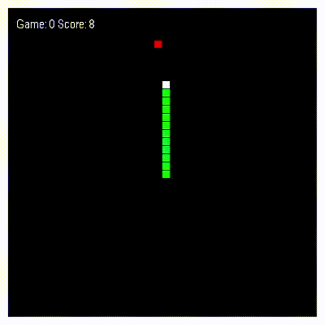

# Snake-AI

The current project is an implementation of **Deep Reinforcement Learning** for the game **Snake**. The scope is to 
show how an AI snake learns to play the game on its own.

## Project structure

The code is grouped in the following packages:
- **game_src**: source code for the actual game
- **snake_nn**: source code for the deep learning implementation
- **saved_models**: the folder where models are saved after training. A demo model is included in this folder

For clarity, there are three distinct main files, independent one from another. Even if this duplicates the code, it 
serves better for the demo purposed of the project. Each file can be executed on its own.

- _main.py_ - manual play mode. It loads the game and allows a user to play it.
- _main_ai_train.py_ - executes the training algorithm for the snake and saves the output model.
- _main_ai_replay.py_ - loads a model and runs the game using the neural network from the model.

## Project execution
Clone the current git repository.

Before execution, make sure to install all dependencies from _requirements.txt_. 

`pip install -r requirements.txt`

There is no specific configuration required before running any of the three main files.
The following controls are available:
- while game is running, pressing ESC will quit the game
- during manual play, the snake is controlled with the arrow keys
- during AI execution (either train or replay), the snake speed can be toggled using key S (for "speed")

## Project demo
This is a recording for the execution on the same model which is also included in the project. The model is obtained 
after 750 steps of training.

## Future improvements to be considered
#### Improvement #1

Deep Reinforcement Learning is a reward-based method. The current implementation considers the following situations for 
reward during training:
- positive reward when food is eaten
- negative reward when snake dies
- (small) positive reward when the snake makes on step closer to the food (i.e. it does not move away from it)

Ideally, the last situation should not exist. The AI should not be "convinced" to minimise the distance to the food, 
but should discover this on its own.
The reason why the last condition was added is that no significant improvements were detected during training 
without it.
   
#### Improvement #2
Currently, the state of the snake during training is computed using only the next possible step (continue, left 
or right). This means that the snake cannot "see" further than the next move. One improvement would be to increase during training the number of steps the snake is able to see. 

## TODO
- Code comments will be included in the near future.